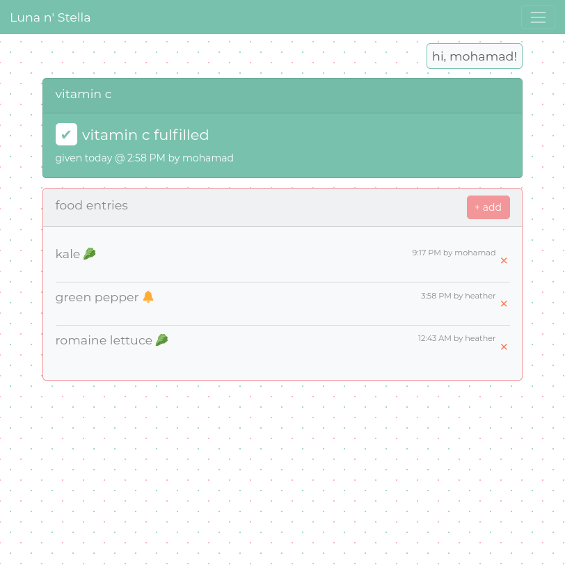
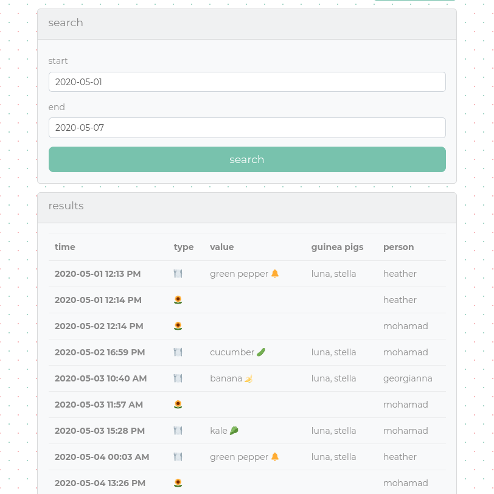

# guineapigs

A web app to log the food I give to my guineapigs.

## Screenshots

|  |  |
|:---:|:---:|
| Dashboard | History |

## Requirements

- Python 3.8+
- PostgreSQL 12+

## Setup

### Install python dependencies

```
git clone https://git.mha.md/mhmd/guineapigs.git
python -m venv .env
source .env/bin/activate
pip install -r requirements
```

### Apply database migrations

```
flask db upgrade
```

### Configure environment variables

Set the variables in [guineapigs/config.py](guineapigs/config.py) in your environment

## Deploy

Run using guincorn

```
gunicorn latenight:app
```

I recommend serving through nginx.

## License

AGPL
